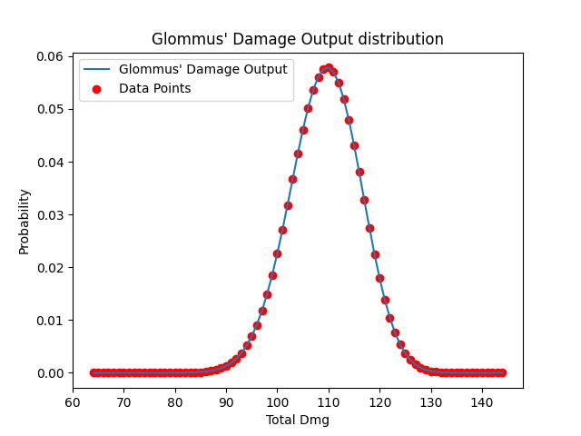
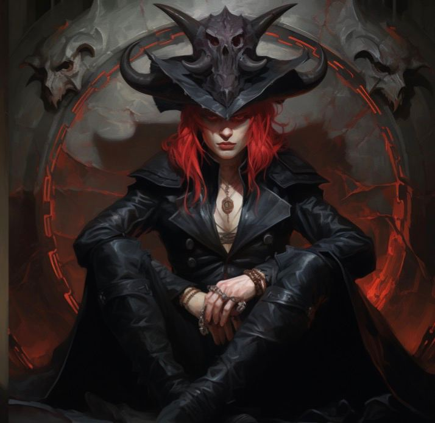

# DMG Output

## Glommus, Echo Knight lvl 11

### Arsenal
- Action Surge
    - Take another Action
- Unleash Incarnation x4 (Con)
    - When taking the Attack Action
- Extra Attack (2)
    - When taking the Attack Action

#### 2 Attack Actions:
- 1 Attacks per Attack Action from 'Unleash Incarnation'
- 3 Attacks per Attack Action from 'Extra Attack'

In Total 8 Attacks with Greatsword `2d6` and the feat 'Great Weapon Fighting' (re-roll 1 and 2 once).

Dice roll probabilities:

| tot  |    P     |
|:---: |:--------:|
|  2   |  0.0216  |
|  3   |  0.0432  |
|  4   |  0.0555  |
|  5   |  0.0679  |
|  6   |  0.1080  |
|  7   |  0.1481  |
|  8   |  0.1543  |
|  9   |  0.1604  |
|  10  |  0.1203  |
|  11  |  0.0802  |
|  12  |  0.0401  |

With an additional `+6` to the dmg roll the dmg output would look like
(with the assumption that every attack hits)

| tot  | dmg  |  x8  |    P     |
|:---: |:---: |:---: |:--------:|
|  2   |  8   |  64  |  0.0216  |
|  3   |  9   |  72  |  0.0432  |
|  4   |  10  |  80  |  0.0555  |
|  5   |  11  |  88  |  0.0679  |
|  6   |  12  |  96  |  0.1080  |
|  7   |  13  |  104 |  0.1481  |
|  8   |  14  |  112 |  0.1543  |
|  9   |  15  |  120 |  0.1604  |
|  10  |  16  |  128 |  0.1203  |
|  11  |  17  |  136 |  0.0802  |
|  12  |  18  |  144 |  0.0401  |

After iterating all possible Damage Rolls with 8 Attacks, the resulting probability graph shows the damage probability distribution. The graph data can be found in `damage_distribution.json`.

# Example opponent

Let's imagine a feasible opponent at lvl 10:

    

|  AC  |  HP  |
|:----:|:----:|
|  17  |  69  |

With `+10` on Attack Rolls it would require $>=7$ on the `1d20` roll, giving a $\frac{14}{20}=0,7$ chance of hitting.
Based on the probabilities from the graph (and `damage_distribution.json`), with 8 attacks Glommus can deal above `69` damage with a certainty of `~100.00% (99.9999999)`, leaving the probability of killing the opponent solely to the Attack Rolls.

With `+10` on Attack Rolls hits with `p=70.00%`.
Giving the final probability of killing the opponent: `70.00%`.

|  AC  |  HP  | DthCh |
|:----:|:----:|:-----:|
|  17  |  69  |  >70% |

